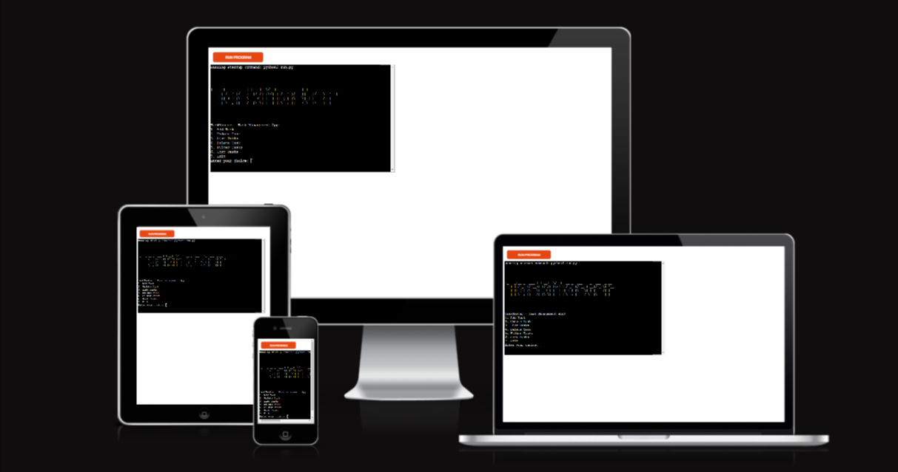
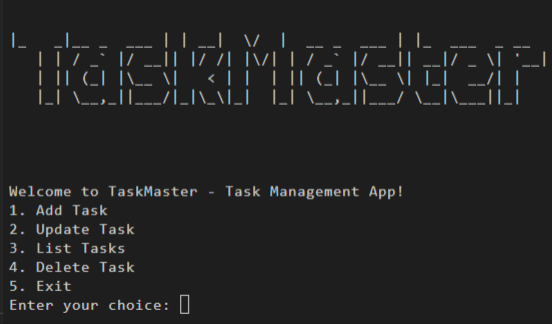
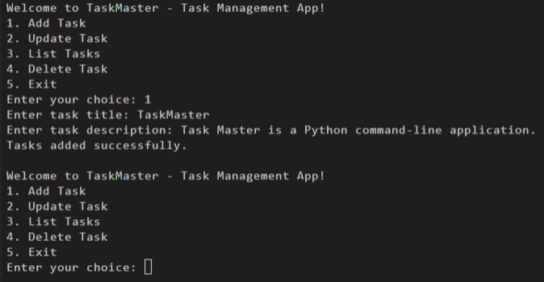

# Task Master

Task Master is a Python command-line application designed to help users organize and manage their tasks efficiently. It provides a user-friendly interface where users can add, update, list, and delete tasks. The application utilizes basic data structures such as lists and dictionaries to store task information and incorporates file I/O operations for persistent data storage.

## Table of Contents

- [Task Master](#task-master)
  - [Project Overview](#project-overview)
  - [Main Technologies](#main-technologies)
  - [Features](#features)
    - [App Overview](#app-overview)
    - [Screenshots](#screenshots)
    - [Implemented Features](#implemented-features)
    - [How to Use](#how-to-use)
  - [Core Logic for Managing Tasks](#core-logic-for-managing-tasks)
  - [Documentation](#documentation)
  - [Testing](#testing)
  - [Bugs](#bugs)
  - [Validator Testing](#validator-testing)
  - [Deployment](#deployment)
  - [Credits](#credits)

## Project Overview

Task Master is developed to provide users with a simple yet effective tool for managing their tasks. The project aims to enhance productivity and organization by offering essential task management functionalities through a command-line interface.

## Main Technologies

Task Master primarily utilizes core Python functionalities for its implementation.

### Features

### App Overview

Task Master presents a menu-driven interface with options for adding, updating, listing, and deleting tasks. Users interact with the application through intuitive commands, making task management seamless and efficient.

### Screenshots

##### Figure 1: Task Management Application - Main Menu

##### Figure 2: Task Management Application - Menu-Driven Interface Flowchart

##### Figure 3: Task Management Application - Add Task

### Implemented Features

1. **Task Deadlines:** Users can now add deadlines to tasks, allowing for better task tracking and time management.

2. **Adding Tasks:** Users can add new tasks to the task list, providing a title, description, and optional deadline.

3. **Updating Tasks:** Users can update existing tasks, modifying their title, description, status, or deadline as needed.

4. **Listing Tasks:** Users can view a list of all tasks, including their titles, descriptions, statuses, and deadlines.

5. **Deleting Tasks:** Users can delete tasks from the task list, removing them permanently.

6. **Task Filtering and Sorting:** Users can filter and sort tasks based on criteria such as priority, due date, and status.

## How to Use

To use Task Master, follow these steps:

1. Select the desired option from the menu to perform specific tasks, such as adding, updating, listing, or deleting tasks.
2. Input the required information as prompted by the application.
3. Follow the on-screen instructions to navigate through the various functionalities of Task Master.

## Core Logic for Managing Tasks

The core logic for managing tasks is implemented within the Python script. This includes functions for adding tasks, updating task status, listing tasks, and deleting tasks. Basic data structures such as lists and dictionaries are used to store task information.

## Documentation

### Libraries Used:

The following external Python libraries are used in the project:

- **gspread**: Used for interacting with Google Sheets to store and manage task data.
- **google-auth**: Used for handling authentication with Google Sheets API.

### Rationale:

- **gspread**: Google Sheets provides a convenient way to store task data in a cloud-based spreadsheet, allowing for easy access and collaboration between users.
- **google-auth**: Google authentication ensures secure access to the Google Sheets API, protecting user data and privacy.

The codebase is documented with comments to explain the purpose and functionality of each function or section.

## Testing

I have manually tested Task Master by performing the following steps:

1. Passed the code through the Python linter and confirmed there are no syntax or style problems.
2. Provided invalid inputs, such as strings where integers are expected, out-of-bound inputs, and duplicate inputs for various operations like adding, updating, listing, or deleting tasks. Ensured that the application handles invalid inputs gracefully and displays appropriate error messages.
3. Tested different combinations of task data, including various titles, descriptions, and statuses, to ensure that tasks are added, updated, listed, and deleted accurately.
4. Checked for each outcome of the task management operations to verify if the correct output is displayed. Ensured that tasks are manipulated as expected and that the application behaves correctly in all scenarios.
5. Verified the functionality for multiple task management sessions to ensure that the tasks are persisted correctly between sessions and that the application maintains accurate task data.

## Bugs

The known issues have been resolved.

## Validator Testing

No errors were returned from the pep8ci.herokuapp.com

## Deployment

Task Master has been successfully deployed using Heroku. Follow these steps to deploy the app:

1. Clone this repository: <https://github.com/yosephdev/TaskMaster>.
2. Create a new Heroku app.
3. Set the config vars key PORT and value 8000.
4. Set the build packs to Python and NodeJS in that order.
5. Link the Heroku app to the repository.
6. Click on deploy.

## Credits

- [Mitko Bachvarov](https://www.linkedin.com/in/mitko-bachvarov-40b50776/) for project guidance and feedback.
- Credits to [Code Institute](https://www.codeinstitute.net) for the deployment terminal
- Credits to the Python community for providing valuable resources for Python development.