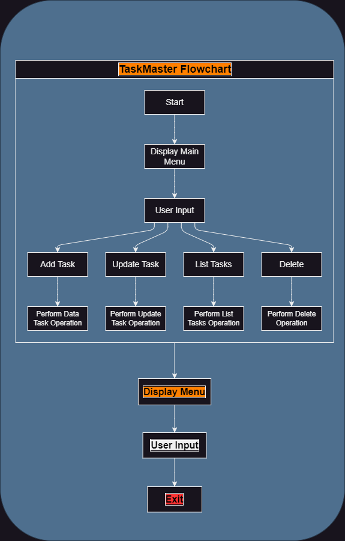

# Task Management App

Welcome to the Task Management App! This command-line application is designed to help users organize and manage their tasks effectively. Whether you're a busy professional, a student with deadlines, or someone looking to stay organized, this app provides a comprehensive set of features to create, update, prioritize, and track tasks.

## Table of Contents

- [Task Management App](#task-management-app)
  - [Project Overview](#project-overview)
  - [Main Technologies](#main-technologies)
  - [Features](#features)
  - [Planned Features](#planned-features)
  - [Initial Design](#initial-design)
      - [Menu-Driven Interface](#menu-driven-interface)
      - [Screenshots](#screenshots)
  - [How to Use](#how-to-use)
  - [Core Logic for Managing Tasks](#core-logic) 

## Project Overview

In this project, I aim to develop a user-friendly command-line application for task management using Python. The goal is to provide users with an efficient and intuitive tool for creating, updating, and tracking tasks to increase productivity and organization.

## Main Technologies

The Task Management App is primarily built using Python.

### Features

#### Planned Features

- **Task Filtering**: Implement functionality to filter tasks based on various criteria, such as priority, due date, or  status.
  
- **Task Reminders**: Introduce reminders for upcoming tasks to help users stay on track and meet deadlines.
  
- **Task Categories**: Allow users to categorize tasks into different categories or projects for better organization.

#### Initial Design

##### Menu-Driven Interface

- The Task Management App features a user-friendly menu-driven interface with the following options:
  - **Add Task**: Allow users to add a new task by providing details such as title, description, and due date.
  - **Update Task**: Enables users to update existing tasks by editing their title, description, due date, or status.
  - **List Tasks**: Displays a list of all tasks, including their titles, descriptions, due dates, and statuses
  - **Delete Task**: Provides users with the ability to remove tasks that are no longer needed.

##### Screenshots

**Figure 1: Task Management Application - Main Menu**

[Main Menu]

**Figure 2: Task Management Application - Menu-Driven Interface Flowchart**

**Figure 3: Task Management Application - Add Task**

[Add Task]

## How to Use

Task Management App is a command-line application, and its usage is straightforward:

1. View existing tasks.
2. Create new tasks.
3. Update or delete tasks as needed.
4. Prioritize tasks based on urgency or importance.

## Core Logic for Managing Tasks

The core logic for managing tasks is implemented within the Python script/module. This includes functions for adding tasks, updating task status, listing tasks, and deleting tasks. Basic data structures such as lists and dictionaries are used to store task information. 

### Step 1: Initialize an Empty List for Tasks

Initialized an empty list to store tasks.

### Step 2: Implement a Function to Load Tasks from a JSON File

Implemented a function `load_tasks()` to load tasks from a JSON file. If the file `tasks.json` exists, tasks are loaded into the global `tasks` list. If the file does not exist, an empty list is assigned to `tasks`.

### Step 3: Implement a Function to Save Tasks to a JSON File

Implemented a function `save_tasks()` to save tasks to a JSON file named `tasks.json`.

### Step 4: Implement a Function to Add a New Task

Implemented a function `add_task(title, description, status='Pending')` to add a new task to the `tasks` list. The task is represented as a dictionary containing 'title', 'description', and 'status' keys. By default, the status is set to 'Pending'. After adding the task, the `save_tasks()` function is called to save the updated task list to the JSON file.